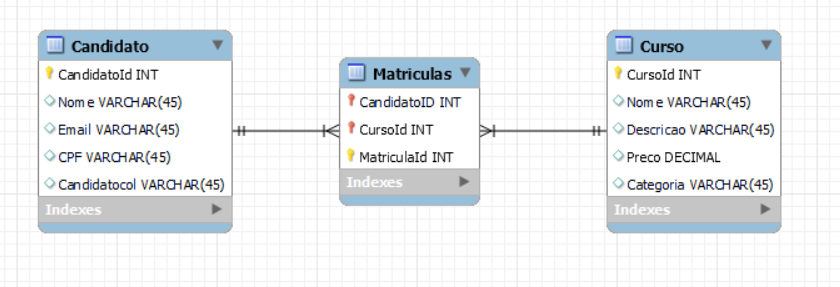
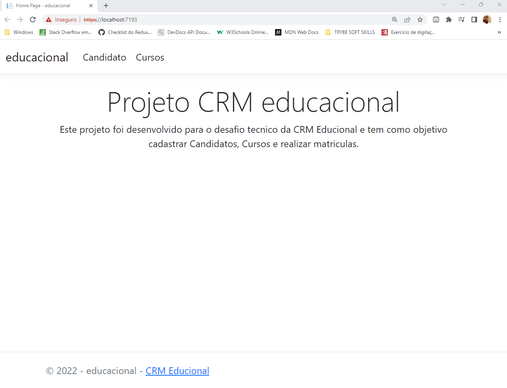
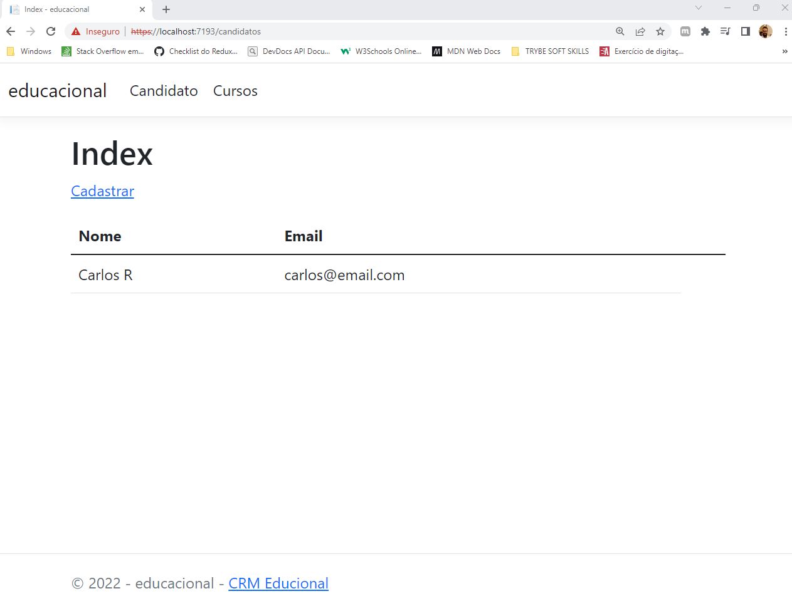
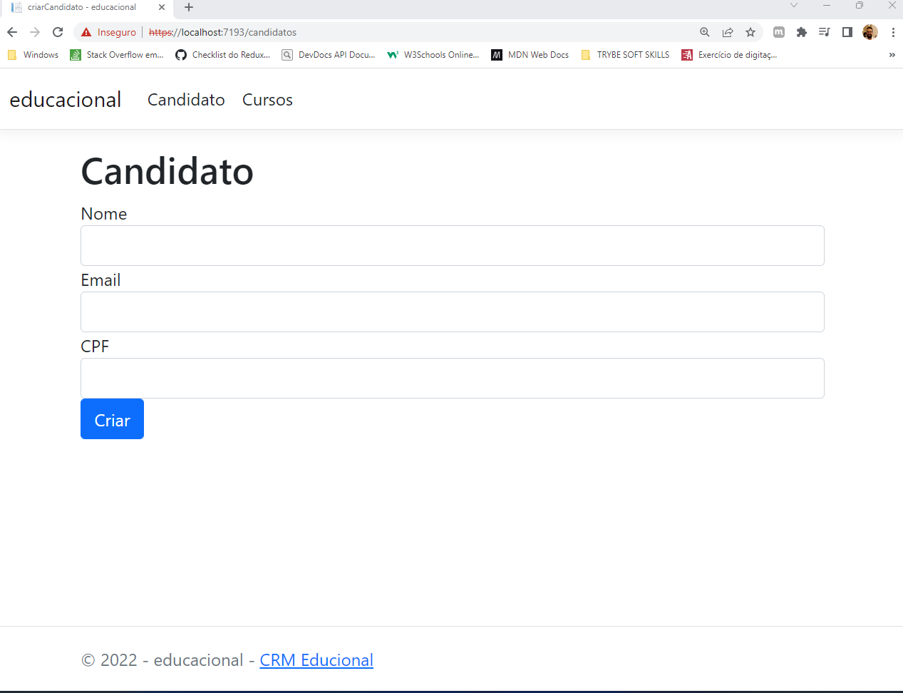

# Olá,  Boas vindas ao projeto CRM_Educacional!

O objetivo deste projeto é criar um Web MVC para cadastrar candidatos, cursos e realizar uma nova inscrição que é composta por um candidato e um curso, e se tiver qualquer dúvida, sugestão, contribuição, considere abrir uma issue ou entrar em contato. 🚀

# Orientações

<details>
  <summary><strong>Rodando no Docker</strong></summary><br />

  O Banco de dados foi criado para iniciar com o docker.
  
  Veja as orientações abaixo para iniciar a execução do projeto.

  > Rode o serviço com o comando `docker-compose up -d`.

  > Instale as dependências com `dotnet restore`.

---
  
  ✨ **Dica:** Para rodar o projeto desta forma, obrigatoriamente você deve ter o ambiente `.NET` na versão 6.0.0 ou superior instalado em seu computador.

  ✨ **Dica:** Verifique se as portas 1433 (para execução do banco de dados), 5033 e 7193 (para execução da Web) estão disponíveis no seu computador.

---

  ## Após a instalação das dependências

  > Use os comandos `dotnet ef database update` para iniciar nosso banco de dados.
  - Ele inicializa e popula o banco de dados desenvolvido com a ORM Entity Framework. 
  Consulte o arquivo `docker-compose` para consultar as entradas para conexão de sua interface de banco de dados SQLServer.

  > Inicie a aplicação com os comandos `dotnet run`.
  - Para executar a aplicação em sua plataforma de cliente da API ou explorá-la no Swagger na seguinte rota:
    `https://localhost:7193`

---

  <br/>
</details>

<details>
  <summary  id="diagrama"><strong>Diagrama ER e Entidades</strong></summary>

  ## Diagrama de Entidade-Relacionamento


  A construção das tabelas através do ORM, seguiu o seguinte *DER*:

  

  ---

  ## Formato das entidades


  Para a criação e atualização do banco de dados foi utilizado a `Entity Framework`. 

  A partir do DER, segue os exemplos com a descrição das tabelas do banco de dados:


  - Uma tabela chamada **Candidato**, contendo dados com a seguinte estrutura:

    ```json
    {
      "CandidatoId": 1,
      "Nome": "carlos G.",
      "Email": "carlosg@email.com",
      "CPF": "213.495.351-35",
    }
    ```
  - Uma tabela chamada **Matricula**, contendo dados com a seguinte estrutura:

    ```json
    {
      "MatriculaId": 1, 
      "CursoId": 1, // Chave primária e estrangeira, referenciando o id de `Curso`
      "CandidatoId": 1, // Chave primária e estrangeira, referenciando o id de `Candidato`
    }
    ```

  - Uma tabela chamada **Curso**, contendo dados com a seguinte estrutura:

    ```json
    {
      "CursoId": 1,
      "Nome": "C#, para iniciantes",
      "Descricao": "Curso para quem deseja aprender C#",
      "Preco": 54.90,
      "Categoria": "Tecnologia"
    }  
    ``` 

    *Os dados acima e do banco de dados são fictícios, e estão aqui apenas para simular o funcionamento.*

    ---

<br />

</details>


# Implementação

✨ **Atenção** As telas a seguir servem para ilustrar o funcionamento do projeto

## Home Page
A tela inicial deste projeto serve para apresentar ele e podemos acessar ele cliando no nome educacional ou em CRM Educacional no rodapé da página. 


## Candidatos

A pagina de candidatos deveria retornar todos candidatos e ter um link que redireciona para uma página de formulário de cadastro de novo candidato, porém este link ainda esta sendo implementado



## Cadastro

O formulário de Cadastro tem os seguintes campos: Nome, Email e CPF. Todos os campos são de preenchimento obrigatório e deve ser fornecido um CPF válido, além disto é verificado se o CPF já não foi cadastrado.


A mesma ideai deveria se repetir o cadastro e visualização de cursos e para um candidato fazer a matricula em um curso. 

<details>
  <summary><strong> Mande seu feedback sobre o projeto!</strong></summary><br />

Se estiver a vontade, clone o repositório e, execute, veja o deploy e ajude a melhorar este projeto! Seu feedback será super bem vindo!


</details>